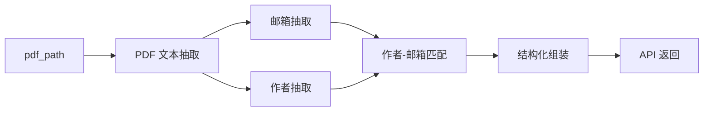

# Author Email Extractor

> 一个本地可运行的微服务：输入论文 PDF 路径，输出作者、邮箱、作者-邮箱匹配结果，以及 `first_author` / `first_author_email` 等关键字段。

## 项目定位

| 维度 | 说明 |
| --- | --- |
| 📥 输入 | `pdf_path` |
| 📤 输出 | `structured_email_string`、`stats`、`code`、`message` |
| 📌 V1 语义 | `first_author` 永远表示作者顺序上的第一作者 |
| 📌 V1 约束 | `first_author_email` 只能来自已确认 pair |
| 📌 返回格式 | `structured_email_string` 是 JSON 字符串，不是对象 |

这个仓库适合：

- 需要在本地从论文 PDF 中抽取作者和邮箱的人
- 需要通过 HTTP 接口调用结构化结果的人
- 需要重点关注 `first_author`、`first_author_email`、`pairs` 等字段的人

## 快速导航

- [⚡ 3 分钟跑通](#-3-分钟跑通)
- [🧭 项目流程](#-项目流程)
- [🚀 启动服务](#-启动服务)
- [🖥️ 推荐使用方式](#️-推荐使用方式)
- [🔧 更多调用方式](#-更多调用方式)
- [📦 请求与响应说明](#-请求与响应说明)
- [❗ 错误码说明](#-错误码说明)
- [✅ 快速验收](#-快速验收)
- [❓ FAQ](#-faq)
- [📎 已知限制](#-已知限制)
- [📚 进一步阅读](#-进一步阅读)

## ⚡ 3 分钟跑通

### 1. 安装依赖

建议环境：

- Python `3.10+`
- 虚拟环境

```bash
python -m venv .venv
python -m pip install --upgrade pip
python -m pip install -r requirements.txt
```

Windows PowerShell 激活虚拟环境：

```bash
.\.venv\Scripts\Activate.ps1
```

macOS / Linux 激活虚拟环境：

```bash
source .venv/bin/activate
```

### 2. 启动服务

在项目根目录执行：

```bash
python -m uvicorn app:app --host 127.0.0.1 --port 8000
```

### 3. 选择一种方式调用

- 浏览器打开：`http://127.0.0.1:8000/`
- PowerShell 执行：`.\call_api.ps1 "<ABSOLUTE_PDF_PATH>"`
- Python 执行：`python client.py "<ABSOLUTE_PDF_PATH>"`

### 4. 先看结果中的这几个字段

- `code`
- `first_author`
- `first_author_email`

## 🧭 项目流程

这个项目的主链路可以概括为：



如果你只关心“先怎么理解它”，可以先记住下面这句话：

> 先抽文本，再抽邮箱，再抽作者，再做匹配，再组装结果，最后通过 API 返回。

## 🚀 启动服务

服务启动命令：

```bash
python -m uvicorn app:app --host 127.0.0.1 --port 8000
```

启动后可访问：

- `http://127.0.0.1:8000/`
- `http://127.0.0.1:8000/docs`
- `http://127.0.0.1:8000/openapi.json`

接口地址：

- `POST http://127.0.0.1:8000/extract-author-emails`

## 🖥️ 推荐使用方式

### 方式 1：浏览器极简页面

这是交付给普通调用者时最省操作的方式。

1. 启动服务
2. 打开 `http://127.0.0.1:8000/`
3. 在页面中填写：
   - `pdf_path`
4. 点击 `Execute`
5. 页面默认查看：
   - `code`
   - `message`
   - `first_author`
   - `first_author_email`
   - `first_author_region`
6. 如需完整结果，再展开：
   - `Expand full response`

输入框只需要填写一个字段，例如：

```text
<ABSOLUTE_PDF_PATH>
```

或：

```text
C:/path/to/file.pdf
```

### 方式 2：Windows PowerShell

这是主要推荐的命令行调用方式。

原因：

- 最直接
- 最透明
- 最适合调试和理解接口返回
- 可以清楚看到请求体与响应体结构

完整示例：

```powershell
$body = @{
  pdf_path = "<ABSOLUTE_PDF_PATH>"
} | ConvertTo-Json

$resp = Invoke-RestMethod `
  -Uri "http://127.0.0.1:8000/extract-author-emails" `
  -Method Post `
  -ContentType "application/json" `
  -Body $body

$payload = $resp.structured_email_string | ConvertFrom-Json

[PSCustomObject]@{
  code = $resp.code
  message = $resp.message
  first_author = if ($payload.first_author) { $payload.first_author.author_norm } else { $null }
  first_author_email = $payload.first_author_email
  first_author_region = $payload.first_author_region
  pairs = $payload.pairs
}
```

如果你想直接查看原始响应对象，也可以先执行：

```powershell
$resp
```

### 方式 3：Swagger UI (`/docs`)

如果你更习惯 Swagger UI：

1. 打开 `http://127.0.0.1:8000/docs`
2. 找到 `POST /extract-author-emails`
3. 点击 `Try it out`
4. 输入：

```json
{
  "pdf_path": "<ABSOLUTE_PDF_PATH>"
}
```

5. 点击 `Execute`
6. 查看返回中的：
   - `code`
   - `message`
   - `structured_email_string`

如果要看 `first_author` 和 `first_author_email`，需要把 `structured_email_string` 再解析一次。

## 🔧 更多调用方式

<details>
<summary>Windows curl</summary>

```bash
curl -X POST "http://127.0.0.1:8000/extract-author-emails" ^
  -H "Content-Type: application/json" ^
  -d "{\"pdf_path\":\"C:/path/to/file.pdf\"}"
```

</details>

<details>
<summary>macOS / Linux curl</summary>

```bash
curl -X POST "http://127.0.0.1:8000/extract-author-emails" \
  -H "Content-Type: application/json" \
  -d '{
    "pdf_path": "/path/to/file.pdf"
  }'
```

</details>

<details>
<summary>Python requests</summary>

推荐直接使用项目自带客户端：

```bash
python client.py "<ABSOLUTE_PDF_PATH>"
```

自定义服务地址：

```bash
python client.py "<ABSOLUTE_PDF_PATH>" --base-url http://127.0.0.1:8767
```

查看完整响应：

```bash
python client.py "<ABSOLUTE_PDF_PATH>" --show-full-response
```

如果你仍然想手写 requests 调用，也可以参考下面的方式：

```python
import json
import requests

response = requests.post(
    "http://127.0.0.1:8000/extract-author-emails",
    json={"pdf_path": "<ABSOLUTE_PDF_PATH>"},
    timeout=60,
)
response.raise_for_status()

data = response.json()
payload = json.loads(data["structured_email_string"]) if data["structured_email_string"] else {}

print("code =", data["code"])
print("message =", data["message"])
print("first_author =", payload.get("first_author"))
print("first_author_email =", payload.get("first_author_email"))
```

</details>

<details>
<summary>Postman / Apifox / 类似客户端</summary>

配置方式：

- Method：`POST`
- URL：`http://127.0.0.1:8000/extract-author-emails`
- Header：`Content-Type: application/json`
- Body：`raw` + `JSON`

示例 body：

```json
{
  "pdf_path": "<ABSOLUTE_PDF_PATH>"
}
```

</details>

<details>
<summary>可选简化方式：<code>call_api.ps1</code></summary>

如果你不想手写 JSON body，可以使用这个更省事的包装脚本。

它本质上仍然是在调用同一个：

- `POST /extract-author-emails`

最简用法：

```powershell
.\call_api.ps1 "<ABSOLUTE_PDF_PATH>"
```

如果本机执行策略禁止直接运行脚本，也可以使用：

```powershell
powershell -ExecutionPolicy Bypass -File .\call_api.ps1 "<ABSOLUTE_PDF_PATH>"
```

自定义服务地址：

```powershell
.\call_api.ps1 "<ABSOLUTE_PDF_PATH>" -BaseUrl "http://127.0.0.1:8767"
```

查看完整响应：

```powershell
.\call_api.ps1 "<ABSOLUTE_PDF_PATH>" -ShowFullResponse
```

</details>

<details>
<summary>可选简化方式：<code>client.py</code></summary>

如果你更习惯直接运行一个 Python 包装脚本，也可以使用这个客户端。

它同样是在调用同一个：

- `POST /extract-author-emails`

最简用法：

```bash
python client.py "<ABSOLUTE_PDF_PATH>"
```

自定义服务地址：

```bash
python client.py "<ABSOLUTE_PDF_PATH>" --base-url http://127.0.0.1:8767
```

查看完整响应：

```bash
python client.py "<ABSOLUTE_PDF_PATH>" --show-full-response
```

</details>

## 📦 请求与响应说明

### 请求体

```json
{
  "pdf_path": "<ABSOLUTE_PDF_PATH>"
}
```

### 成功响应顶层字段

| 字段 | 说明 |
| --- | --- |
| `structured_email_string` | JSON 序列化后的结构化结果 |
| `stats` | 摘要计数信息 |
| `code` | 稳定结果码 |
| `message` | 人类可读的简短消息 |

### 重要说明

> `structured_email_string` 是 JSON 字符串，不是对象。  
> 要访问 `first_author`、`first_author_email`、`pairs`，需要先做二次解析。

示意：

```python
import json

payload = json.loads(response_json["structured_email_string"])
first_author = payload["first_author"]
first_author_email = payload["first_author_email"]
```

`stats` 用于提供摘要计数，例如：

- 作者数量
- 邮箱数量
- pair 数量
- 未匹配作者数量
- 未匹配邮箱数量
- 是否找到 `first_author`

## ❗ 错误码说明

| `code` | 触发场景 |
| --- | --- |
| `INVALID_REQUEST` | 缺少 `pdf_path`、`pdf_path` 为空、请求体不是合法 JSON 对象 |
| `PATH_NOT_FOUND` | `pdf_path` 指向的文件不存在，或路径不可访问 |
| `PARSE_FAILED` | 文件不是合法 PDF，或 PDF 解析/抽取链路失败 |
| `NO_EMAIL_FOUND` | PDF 可以解析，但没有抽取到任何邮箱候选 |
| `INTERNAL_ERROR` | 未预期的内部异常 |

## ✅ 快速验收

最短路径：

1. 安装依赖
2. 启动服务
3. 打开 `http://127.0.0.1:8000/`
4. 输入：
   - `pdf_path`
5. 点击 `Execute`
6. 先看：
   - `code`
   - `first_author`
   - `first_author_email`

## ❓ FAQ

### `/docs` 页面没有输入框怎么办

先确认你访问的是当前服务的：

- `http://127.0.0.1:8000/docs`

再确认服务已经重启到最新版本。

### 为什么 `structured_email_string` 是字符串

这是 V1 对外契约的一部分，不能直接改成对象。

### 为什么 `code=NO_EMAIL_FOUND`

说明 PDF 可以解析，但当前首页和必要时前两页没有识别到邮箱候选。

### 为什么 `first_author` 不是通讯作者

因为 V1 语义固定为：作者顺序上的第一作者。

### 为什么有 `first_author`，但 `first_author_email` 是 `null`

因为 `first_author_email` 只能来自已确认 pair；如果第一作者没有 confirmed pair，就必须保持 `null`。

### PDF 路径应该填什么格式

推荐绝对路径，例如：

- `C:/path/to/file.pdf`
- `/path/to/file.pdf`

### 路径里有空格怎么办

可以直接传，只要整个 JSON 字符串合法、路径真实存在即可。

## 📎 已知限制

- 只看首页和必要时前两页
- OCR 很差的 PDF 可能失败
- 共同一作不会改变 V1 的 `first_author` 语义
- 不会为了 `first_author_email` 反向强配邮箱
- 如果邮箱不在前两页，`first_author_email` 可能为 `null`

## 📚 进一步阅读

- [PROJECT_OVERVIEW.md](./PROJECT_OVERVIEW.md)

README 更偏向“怎么运行、怎么调用、怎么理解接口返回”。  
如果你想从维护者视角快速看懂项目结构、模块职责、数据流和 V1 规则，建议继续阅读 `PROJECT_OVERVIEW.md`。
